# Backend Analysis — Guitar Practice Cloud API (`gpc-api` v3.0.0)

> Scope: everything under `backend/`. Line references point to the source files at the time of analysis.
> Diagrams use [Mermaid](https://mermaid.js.org/) (rendered natively by GitHub, GitLab and VS Code's Markdown preview with a Mermaid extension).

---

## Table of contents

1. [Overview](#1-overview)
2. [Technology stack](#2-technology-stack)
3. [Project structure](#3-project-structure)
4. [Architecture](#4-architecture)
5. [Startup sequence](#5-startup-sequence)
6. [Request pipeline (how requests are received and processed)](#6-request-pipeline)
7. [API endpoints](#7-api-endpoints)
8. [Authentication](#8-authentication)
9. [File upload](#9-file-upload)
10. [Audio streaming and deletion](#10-audio-streaming-and-deletion)
11. [Database link (Mongoose / MongoDB Atlas)](#11-database-link)
12. [Where encryption / hashing / signing occurs](#12-where-encryption-hashing-and-signing-occur)
13. [Error handling](#13-error-handling)
14. [Logging](#14-logging)
15. [Configuration](#15-configuration)
16. [Tests](#16-tests)
17. [Observations, risks and suggested improvements](#17-observations-risks-and-suggested-improvements)

---

## 1. Overview

The backend is a small **REST API** for a guitar-practice application. It lets a user:

- create an account and log in (JWT-based sessions);
- read and rename their profile;
- upload audio recordings ("tracks"), list them with pagination, stream them back and delete them.

Audio **files** are stored on the server's local disk (`data/uploads/`), while their **metadata** (title, size, MIME type, owner…) is stored in **MongoDB Atlas** via Mongoose. The intended client is an Angular frontend (`localhost:4200`).

The whole HTTP layer lives in a single file, [src/app.js](src/app.js), and the process entry point is [src/server.js](src/server.js).

---

## 2. Technology stack

| Layer | Technology | Locked version | Role |
|---|---|---|---|
| Runtime | **Node.js** (ES modules, `"type": "module"`, top-level `await`) | tested with v24.19 | JavaScript server runtime; also loads `.env` natively via `--env-file` |
| Web framework | **Express 5** | 5.2.1 | Routing, middleware chain, JSON parsing, `res.sendFile` |
| CORS | **cors** | 2.8.6 | Adds `Access-Control-Allow-*` headers so the Angular app can call the API |
| File upload | **Multer 2** | 2.3.0 | Parses `multipart/form-data`, writes files to disk |
| Auth tokens | **jsonwebtoken** | 9.0.3 | Signs / verifies JWTs (HS256 by default) |
| Password hashing | **bcryptjs** | 3.0.3 | Pure-JS bcrypt, cost factor 10 |
| ODM | **Mongoose 9** | 9.9.4 | Schemas, validation, hooks, queries to MongoDB |
| Database | **MongoDB Atlas** (cloud) | — | Connection string uses `mongodb+srv://` |
| Built-ins | `node:crypto`, `node:fs`, `node:fs/promises`, `node:path` | — | Random file names, upload directory, file cleanup |
| Tests | `node:test` + `node:assert/strict` + global `fetch` | — | Built-in test runner, no external framework |

No other dependencies: no `dotenv`, no `helmet`, no rate limiter, no validation library, no logger library.

---

## 3. Project structure

```text
backend/
├── .env                  # MONGODB_URI, JWT_SECRET, PORT  (git-ignored)
├── .gitignore            # node_modules/, data/uploads/*, .env
├── package.json          # scripts: start, start:local, test
├── data/
│   └── uploads/          # audio files (created at startup, git-ignored)
├── src/
│   ├── server.js         # entry point: DB connection, demo user seed, listen()
│   ├── app.js            # createApp(): middlewares, auth, Multer, all routes, error handler
│   └── models/
│       ├── User.js       # User schema, password virtual, bcrypt hook, toPublic()
│       └── Track.js      # Track schema (audio metadata), indexes, toPublic()
├── test/
│   └── api.test.js       # health check + schema tests
├── AGENTS.md / CLAUDE.md / GEMINI.md / best-practices.md   # guidance for AI assistants & students
```

A deliberate design choice: **`createApp()` builds the Express app without opening a port** ([src/app.js:127](src/app.js#L127)). `server.js` calls `.listen()`; the tests call `createApp().listen(0)` on a random port. This separation makes the app testable.

---

## 4. Architecture

### 4.1 Component view

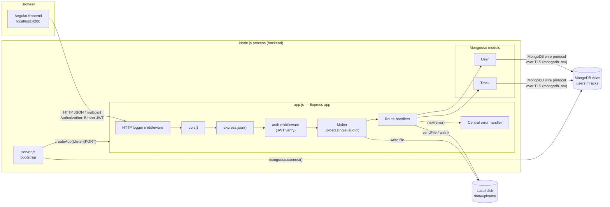

### 4.2 Architectural style

- **Monolithic, layered REST API**. Although everything is in one file, the logical layers are clear:

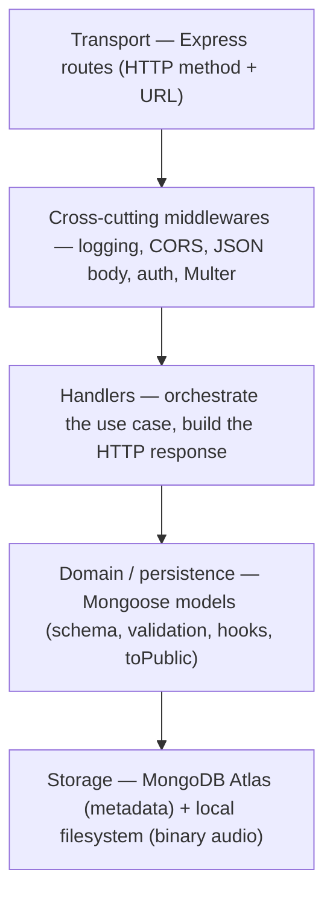

- **Hybrid storage**: binaries on disk, metadata in the database, linked by `Track.storedName` (a random UUID file name).
- **Stateless authentication**: no server-side session store; every private request carries a JWT.
- **Resource ownership** is enforced at query level (`{ _id, ownerId: req.auth.sub }`), so a user can never read/delete another user's track — the query simply returns nothing → `404`.

### 4.3 Data model

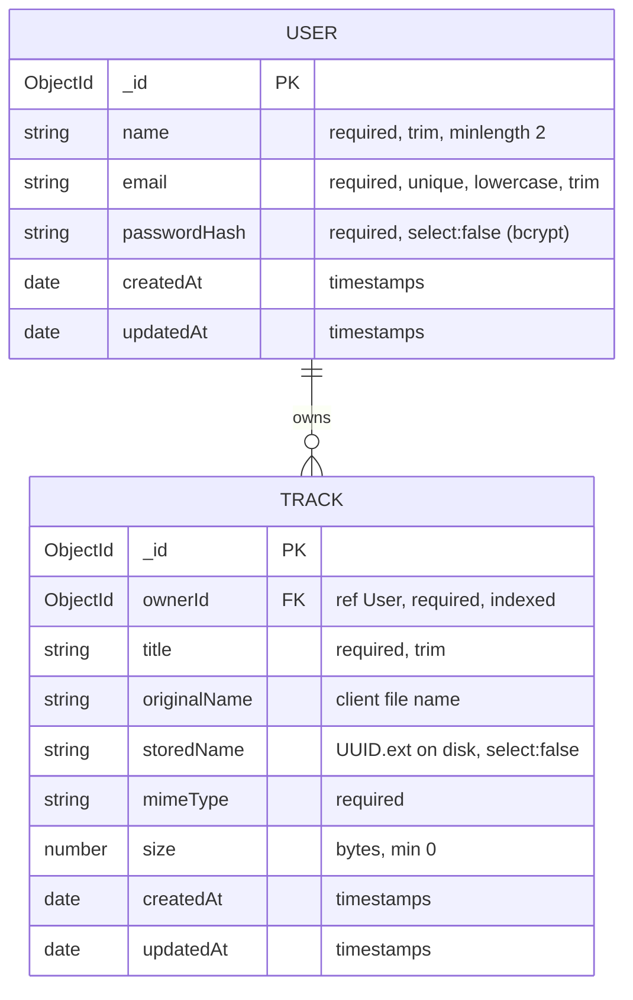

Indexes:

| Collection | Index | Purpose |
|---|---|---|
| `users` | `{ email: 1 }` unique | Login lookup + duplicate prevention |
| `tracks` | `{ ownerId: 1 }` | Filter by owner |
| `tracks` | `{ ownerId: 1, createdAt: -1 }` | "My tracks, newest first" (paginated list) — [Track.js:26](src/models/Track.js#L26) |

Note: the single `{ ownerId: 1 }` index is made redundant by the compound index (its prefix).

---

## 5. Startup sequence

`npm start` → `node --env-file=.env src/server.js`

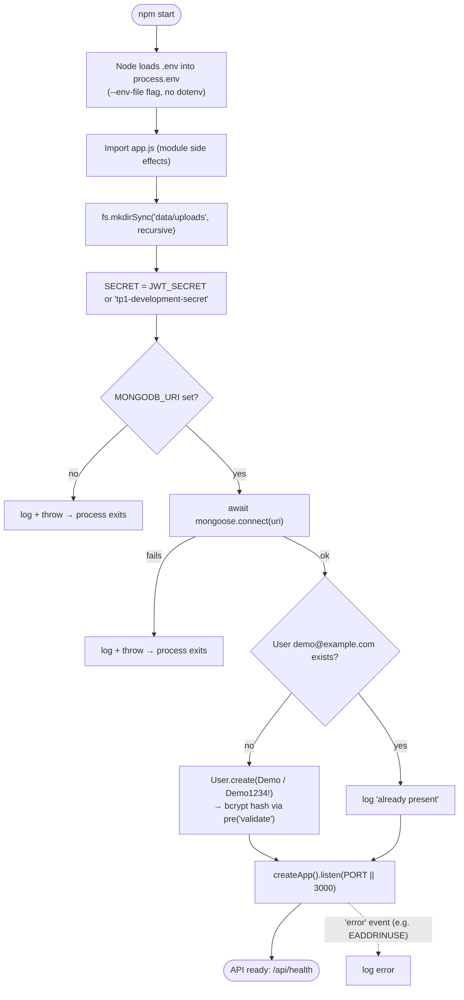

Key points ([src/server.js](src/server.js)):

- The API **refuses to start** without a DB connection — it never serves requests that would fail on the database.
- Top-level `await` (ESM) is used to sequence connect → seed → listen.
- The upload directory is created **at import time** of `app.js` (synchronously), with a path relative to the **current working directory** (`path.resolve("data/uploads")`). Running the server from another directory would create/use a different folder.

---

## 6. Request pipeline

### 6.1 How requests reach the backend

The backend is **only a server**: it receives HTTP requests from the browser and emits requests only to MongoDB. There are three request formats:

| Format | Used by | Example |
|---|---|---|
| `application/json` body | register, login, update profile | `POST /api/auth/login` `{"email":"…","password":"…"}` |
| `multipart/form-data` | track upload | fields `audio` (file) + `title` (text), typically built with `FormData` in Angular |
| No body + query string | lists / reads | `GET /api/tracks?page=2&limit=10` |

Private routes additionally require the header `Authorization: Bearer <JWT>`.

### 6.2 Middleware chain

Middlewares run in registration order ([src/app.js:132-150](src/app.js#L132-L150)); route-level middlewares (`auth`, `upload.single`) run only on the routes that declare them.

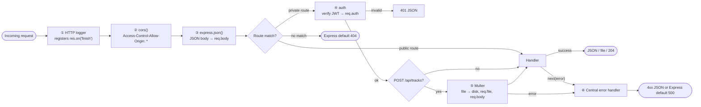

Express 5 automatically forwards rejected promises of `async` handlers to the error handler, but the code still wraps each handler in `try/catch` and calls `next(error)` explicitly (with a log first), as required by the project guidelines.

---

## 7. API endpoints

| Method | URL | Auth | Input | Success | Errors |
|---|---|---|---|---|---|
| GET | `/api/health` | — | — | `200 {status:"ok"}` | — |
| POST | `/api/auth/register` | — | JSON `{name, email, password}` (password ≥ 8) | `201 {token, user}` | `400` invalid, `409` email used |
| POST | `/api/auth/login` | — | JSON `{email, password}` | `200 {token, user}` | `401` bad credentials |
| GET | `/api/users/me` | JWT | — | `200 user` | `401`, `404` |
| PUT | `/api/users/me` | JWT | JSON `{name}` | `200 user` | `400` validation, `401`, `404` |
| GET | `/api/tracks` | JWT | query `page` (≥1, default 1), `limit` (1–20, default 5) | `200 {items, page, limit, total, pages}` | `401` |
| POST | `/api/tracks` | JWT | multipart `audio` (file) + `title` (text, optional) | `201 track` | `400` no file / bad type / too large, `401` |
| GET | `/api/tracks/:id/audio` | JWT | path `id` | `200` binary audio | `401`, `404` unknown / not owner / bad id |
| DELETE | `/api/tracks/:id` | JWT | path `id` | `204` | `401`, `404`, `500` file not deleted |

Public representations (never containing secrets):

- **User** → `{ id, name, email, createdAt }` ([User.js:52](src/models/User.js#L52))
- **Track** → `{ id, ownerId, title, originalName, mimeType, size, createdAt }` ([Track.js:32](src/models/Track.js#L32))

---

## 8. Authentication

### 8.1 Mechanism summary

| Aspect | Implementation |
|---|---|
| Type | Stateless **JWT bearer token** |
| Library | `jsonwebtoken` |
| Algorithm | HS256 (library default, symmetric HMAC-SHA256) |
| Secret | `process.env.JWT_SECRET`, fallback `"tp1-development-secret"` ([app.js:27](src/app.js#L27)) |
| Payload | `{ sub: <user _id>, email, iat, exp }` — **no password** |
| Lifetime | 2 hours (`expiresIn: "2h"`) |
| Transport | `Authorization: Bearer <token>` header |
| Password storage | bcrypt hash (cost 10) in `passwordHash`, `select:false` |
| Logout / revocation | None server-side (client just discards the token) |

### 8.2 Registration

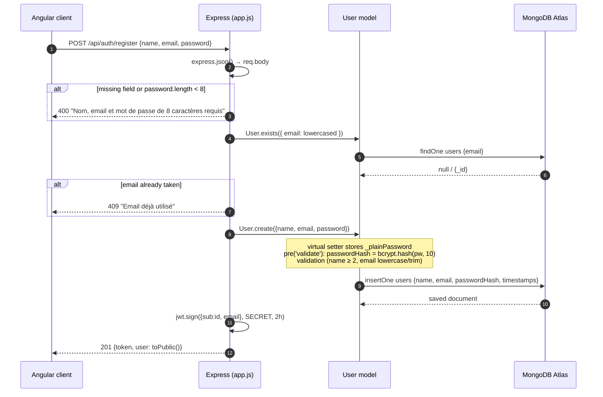

How the password becomes a hash ([src/models/User.js:29-43](src/models/User.js#L29-L43)):

1. `password` is a Mongoose **virtual** — it is never persisted. Its setter copies the value into `this._plainPassword` (in memory only).
2. A `pre("validate")` hook runs before validation, and **only for new documents** (`this.isNew`), and computes `bcrypt.hash(plain, 10)` into `passwordHash`.
3. Because `passwordHash` is `required`, validation fails if no password was given.

### 8.3 Login

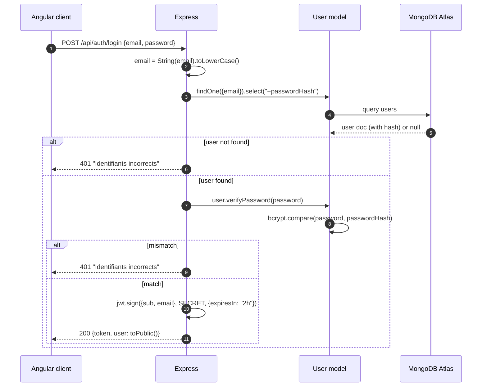

Good practices present: the same generic message is used for "unknown email" and "wrong password" (no user enumeration through the message), the email is coerced with `String()` (blocks `{"$ne": null}`-style NoSQL injection), and the hash is only selected when needed.

### 8.4 Protecting routes — the `auth` middleware

[src/app.js:56-77](src/app.js#L56-L77)

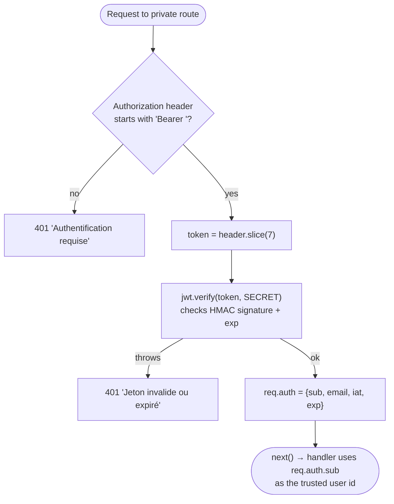

Handlers never trust a user id coming from the body or URL: the identity is **always** `req.auth.sub`, which comes from a signed token.

---

## 9. File upload

### 9.1 Configuration ([src/app.js:31-120](src/app.js#L31-L120))

| Setting | Value | Effect |
|---|---|---|
| Storage engine | `multer.diskStorage` | Streams the file directly to disk (no memory buffering) |
| Destination | `path.resolve("data/uploads")` | Controlled directory, created at startup |
| File name | `crypto.randomUUID() + ext(originalname).toLowerCase()` | Unique, unguessable, no path traversal, no collisions |
| Size limit | 25 MB (`limits.fileSize`) | Multer aborts with `LIMIT_FILE_SIZE` and removes the partial file |
| Type filter | MIME in `{audio/mpeg, audio/wav, audio/x-wav, audio/ogg, audio/mp4, audio/x-m4a}` | Rejected files are never written |
| Field | `upload.single("audio")` | Exactly one file in field `audio` → `req.file` |
| Scope | Only on `POST /api/tracks` | Multer is not global |

### 9.2 Upload workflow

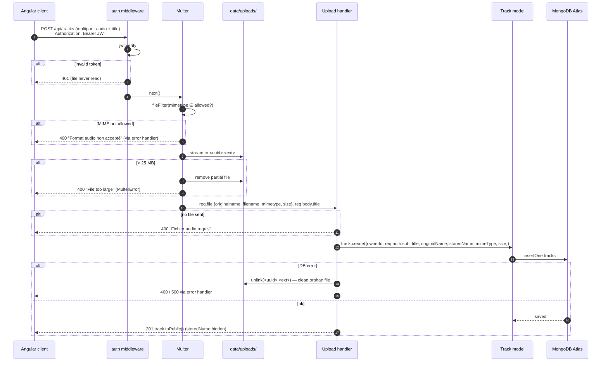

### 9.3 Storage split

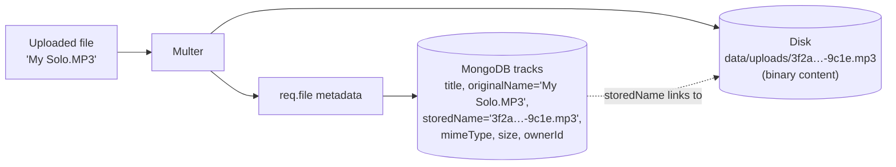

---

## 10. Audio streaming and deletion

### 10.1 Streaming — `GET /api/tracks/:id/audio`

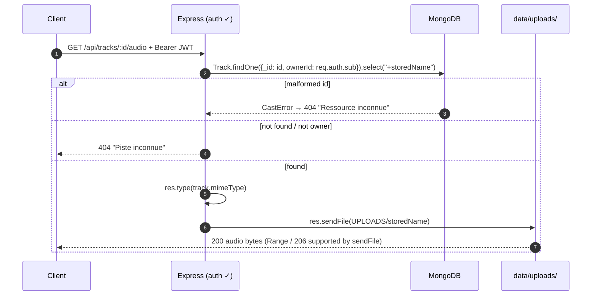

- The path is built **only** from server-controlled data (`UPLOADS` + `storedName` from the DB), never from client input.
- `res.sendFile` (via the `send` module) handles `Range` requests, `ETag`, `Last-Modified` — so seeking in an audio player works.
- Because authentication uses a header, a plain `<audio src="…">` tag cannot send the token; the frontend must `fetch`/`HttpClient` the file as a Blob and use `URL.createObjectURL`.

### 10.2 Deletion — `DELETE /api/tracks/:id`

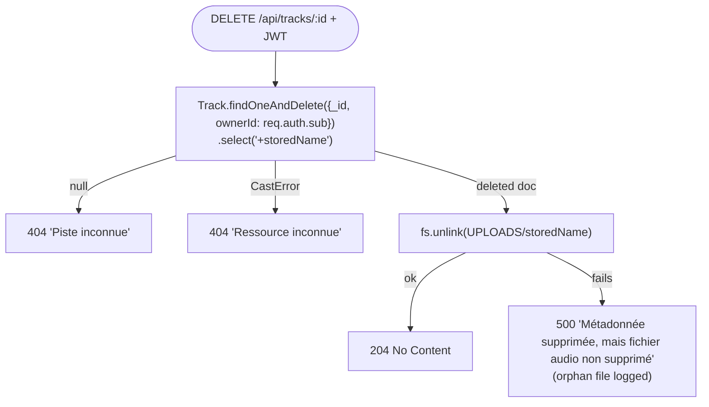

Order: **database first, then disk**. If the disk operation fails the metadata is already gone, leaving an orphan file; this is reported explicitly rather than hidden.

### 10.3 Paginated list — `GET /api/tracks`

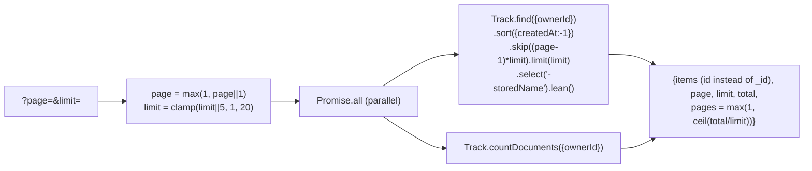

---

## 11. Database link

### 11.1 Where the link is made

| What | Where |
|---|---|
| Connection string | `MONGODB_URI` in `.env` (scheme `mongodb+srv://` → MongoDB Atlas) |
| Connection opening | `await mongoose.connect(uri)` — [src/server.js:18](src/server.js#L18) |
| Models (collections) | `mongoose.model("User", …)` → collection `users` ([User.js:61](src/models/User.js#L61)); `mongoose.model("Track", …)` → `tracks` ([Track.js:45](src/models/Track.js#L45)) |
| Queries | Only in [src/app.js](src/app.js) handlers and [src/server.js](src/server.js) (demo seed) |

Mongoose keeps a **single global connection** (with the driver's connection pool). The models are registered on that global instance, so `app.js` can use `User`/`Track` without receiving the connection explicitly. The database name (`guitar-practice-cloud` according to the logs) comes from the URI.

### 11.2 Queries used

| Operation | Mongoose call | Location |
|---|---|---|
| Check duplicate email | `User.exists({ email })` | register, demo seed |
| Create user | `User.create({...})` | register, demo seed |
| Login lookup | `User.findOne({ email }).select("+passwordHash")` | login |
| Profile | `User.findById(req.auth.sub)` | GET /users/me |
| Rename | `User.findByIdAndUpdate(id, {$set:{name}}, {new:true, runValidators:true})` | PUT /users/me |
| List tracks | `Track.find(filter).sort().skip().limit().select().lean()` + `Track.countDocuments(filter)` | GET /tracks |
| Create track | `Track.create({...})` | POST /tracks |
| Read one track | `Track.findOne({_id, ownerId}).select("+storedName")` | GET /tracks/:id/audio |
| Delete track | `Track.findOneAndDelete({_id, ownerId})` | DELETE /tracks/:id |

### 11.3 Request path to the database

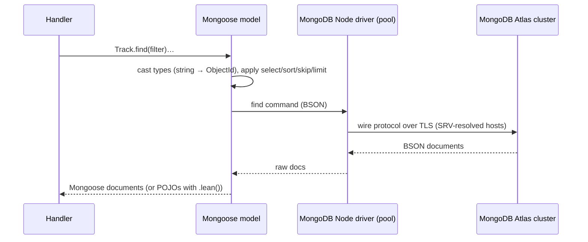

Mongoose adds on top of the raw driver: schema validation, type casting (e.g. `req.auth.sub` string → `ObjectId`, which also throws `CastError` on malformed ids), `select:false` fields, hooks (`pre("validate")`), virtuals and instance methods (`toPublic`, `verifyPassword`).

---

## 12. Where encryption, hashing and signing occur

Strictly speaking, **the application code performs no reversible encryption**. It uses one-way hashing, message authentication (signing) and secure randomness. Encryption only happens in transport/infrastructure layers it relies on.

| # | Mechanism | Kind | Where | Protects |
|---|---|---|---|---|
| 1 | **bcrypt** (`bcryptjs`, cost 10, random salt embedded in hash) | One-way password hashing | [User.js:41](src/models/User.js#L41) (hash), [User.js:48](src/models/User.js#L48) (compare) | Passwords at rest in MongoDB |
| 2 | **JWT HS256** (`jsonwebtoken`) | HMAC-SHA256 signature — **not encryption**, the payload (`sub`, `email`) is only Base64URL-encoded and readable by anyone | [app.js:50](src/app.js#L50) (sign), [app.js:70](src/app.js#L70) (verify) | Integrity/authenticity of the session token |
| 3 | **`crypto.randomUUID()`** | Cryptographically secure random generator (UUID v4) | [app.js:95](src/app.js#L95) | Unpredictable stored file names |
| 4 | **TLS to MongoDB Atlas** | Transport encryption | Implicit: `mongodb+srv://` enables TLS by default | Data in transit between API and DB |
| 5 | **Atlas encryption at rest** | Storage encryption | Atlas platform (outside this code) | DB files on Atlas disks |
| — | Client ↔ API | **Not encrypted** in this code (plain HTTP on `localhost`) | `app.listen()` | Would need HTTPS / reverse proxy in production |
| — | Audio files on disk | **Stored in clear** | `data/uploads/` | No at-rest encryption |

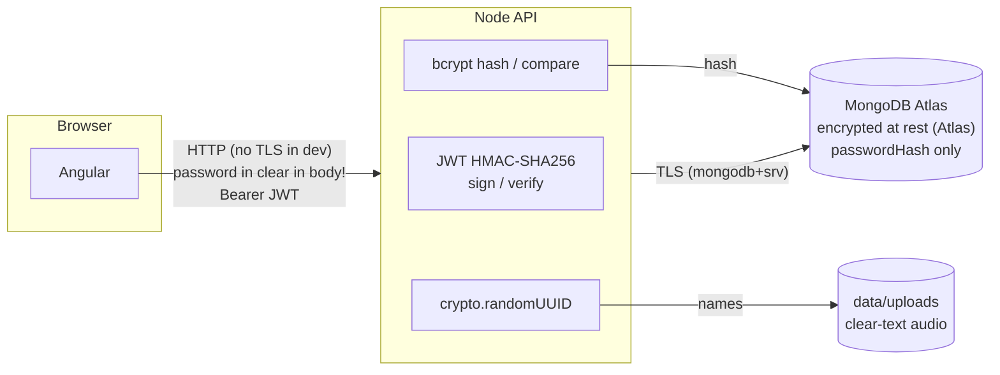

Important consequence: in development, the password travels in clear text between browser and API (plain HTTP). In production, the API must sit behind HTTPS.

---

## 13. Error handling

Each handler: `try { … } catch (error) { console.error(...); next(error); }`. The central handler ([src/app.js:442-459](src/app.js#L442-L459)) maps known errors:

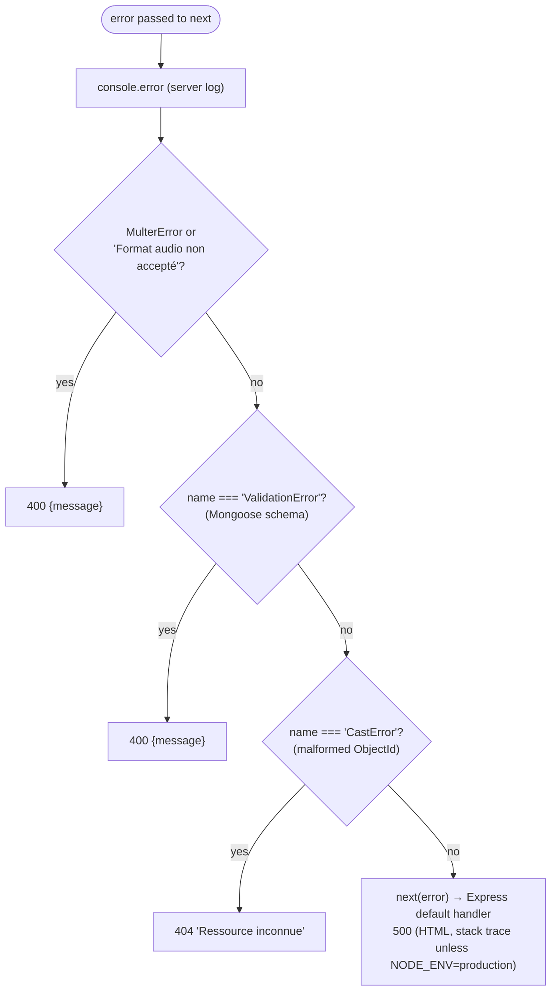

Explicit status codes returned directly by handlers: `400`, `401`, `404`, `409`, `500` (file deletion failure), `201`, `204`.

---

## 14. Logging

Plain `console.*` with a bracketed category prefix:

| Prefix | Content |
|---|---|
| `[startup]` | DB connection, uploads dir, demo account, listen |
| `[http]` | `METHOD URL -> status (ms)` for every request (logged on `finish`) |
| `[auth]` | register/login attempts (email), token creation/acceptance (user id) |
| `[user]`, `[tracks]` | business operations and failures |
| `[multer]` | destination, generated name, accepted/refused MIME |
| `[user-model]`, `[track-model]` | `console.debug` from model methods |
| `[error]` | everything reaching the central handler |

Tokens, passwords, secrets and the MongoDB URI are **not** logged (per `AGENTS.md`). Emails and user ids are logged.

---

## 15. Configuration

| Variable | Required | Default | Used in |
|---|---|---|---|
| `MONGODB_URI` | **yes** (startup fails without it) | — | server.js |
| `JWT_SECRET` | no (!) | `"tp1-development-secret"` | app.js |
| `PORT` | no | `3000` | server.js |

Scripts:

- `npm start` — `node --env-file=.env src/server.js` (Node ≥ 20.6 required for `--env-file`)
- `npm run start:local` — `node src/server.js` (variables must already be in the environment)
- `npm test` — `node --test` (runs `test/*.test.js`)

`best-practices.md` asks for a `.env.example` file; it does not exist yet.

---

## 16. Tests

[test/api.test.js](test/api.test.js) uses the built-in runner:

1. **Health check** — starts `createApp()` on a random port and calls `GET /api/health` with `fetch`. Works **without MongoDB**, thanks to the `createApp`/`listen` separation.
2. **Schema test** — instantiates `User` and `Track` without saving: checks email lowercasing and that `Track.ownerId` references `User`.

Not covered: register/login, JWT rejection, upload (type/size/missing file), ownership checks, pagination, delete, error handler. These would require a test database (e.g. `mongodb-memory-server`) or mocking.

Side effect: importing `app.js` in tests creates `data/uploads/` in the working directory.

---

## 17. Observations, risks and suggested improvements

### 17.1 Strengths

- Clean separation `createApp()` / `listen()` → testable.
- Passwords hashed with bcrypt, hash hidden by `select:false`, never returned (`toPublic`).
- Identity always taken from the verified JWT, ownership enforced in every track query.
- Upload hardening: size limit, MIME allow-list, random server-side name, controlled directory, orphan cleanup on DB failure.
- Server-controlled file paths for streaming; `Range` support via `sendFile`.
- Fail-fast startup if the DB is unreachable.
- Pagination bounded (`limit ≤ 20`) with parallel count.
- Consistent logging with no secrets.

### 17.2 Risks and issues

| # | Severity | Issue | Where | Suggestion |
|---|---|---|---|---|
| 1 | High | **Hard-coded fallback JWT secret**: if `JWT_SECRET` is missing, anyone knowing `"tp1-development-secret"` can forge tokens for any user id | [app.js:27](src/app.js#L27) | Fail at startup when `JWT_SECRET` is absent (like `MONGODB_URI`) |
| 2 | Medium | **Demo account with a known password** (`demo@example.com` / `Demo1234!`) is created on every environment | [server.js:32-49](src/server.js#L32-L49) | Seed only when an env flag (e.g. `SEED_DEMO=true`) is set |
| 3 | Medium | **CORS open to every origin** (`cors()`) | [app.js:145](src/app.js#L145) | `cors({ origin: "http://localhost:4200" })` or env-configured list |
| 4 | Medium | **No rate limiting** on `/api/auth/login` → brute force possible | — | `express-rate-limit` on auth routes |
| 5 | Medium | **Plain HTTP**; passwords and tokens travel unencrypted outside localhost | server.js | HTTPS / TLS-terminating reverse proxy in production |
| 6 | Medium | **Duplicate-email race**: two concurrent registrations pass `User.exists`, the second hits the unique index (`E11000`), which is not mapped → 500 instead of 409 | [app.js:177-184](src/app.js#L177-L184), error handler | Map `error.code === 11000` to `409` |
| 7 | Low | **Type of `password` not checked**: a numeric/array `password` passes `length < 8` (undefined/array length) then makes bcrypt throw → 500. Same for login | [app.js:169](src/app.js#L169), [app.js:209](src/app.js#L209) | Validate `typeof password === "string"` (and email format) |
| 8 | Low | **MIME type trusted from the client** and extension taken from `originalname` independently: e.g. `evil.html` declared `audio/mpeg` is stored as `.html` | [app.js:95](src/app.js#L95), [app.js:111](src/app.js#L111) | Derive the extension from the accepted MIME type; optionally sniff magic bytes (`file-type`) |
| 9 | Low | Unknown errors fall to Express' default handler → HTML body with stack trace in non-production mode, inconsistent with the JSON API | [app.js:458](src/app.js#L458) | Final fallback returning `500 {message:"Erreur interne du serveur"}` |
| 10 | Low | `PUT /api/users/me` without `name` → Mongoose drops the `undefined` key, returns `200` with no change | [app.js:251-255](src/app.js#L251-L255) | Return `400` if `name` is missing |
| 11 | Low | Invalid ObjectId detected only via `CastError` (after DB call attempt) | track routes | `mongoose.isValidObjectId(req.params.id)` first (as recommended in `best-practices.md`) |
| 12 | Low | `GET /api/tracks` items (lean) have a different shape from `toPublic()` (they include `updatedAt`, `__v`) | [app.js:300-304](src/app.js#L300-L304) | Project explicit fields, or reuse a shared mapper |
| 13 | Low | Tokens cannot be revoked (no logout / blacklist); email embedded in payload becomes stale after a change | auth design | Acceptable for a TP; consider short-lived access + refresh tokens |
| 14 | Low | Uploads dir resolved from `process.cwd()`, audio stored unencrypted, no quota per user | [app.js:14](src/app.js#L14) | Resolve relative to the module (`import.meta.dirname`), add quotas; object storage (S3/GridFS) for scale |
| 15 | Info | Delete order DB → disk may leave orphan files; no periodic cleanup | [app.js:411-432](src/app.js#L411-L432) | Background job reconciling disk vs DB |
| 16 | Info | Redundant `{ownerId:1}` index and redundant `.select("-storedName")` (already `select:false`) | Track.js, app.js:290 | Cosmetic cleanup |
| 17 | Info | No security headers (`helmet`), no request body size limit customisation (default 100 kb for JSON — fine) | app.js | Add `helmet()` |
| 18 | Info | Everything in one `app.js` file | — | Split into `routes/`, `middlewares/`, `controllers/` as the API grows |

### 17.3 Suggested target structure (if the project grows)

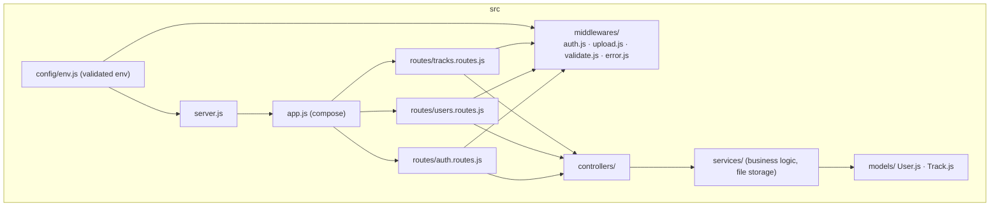
